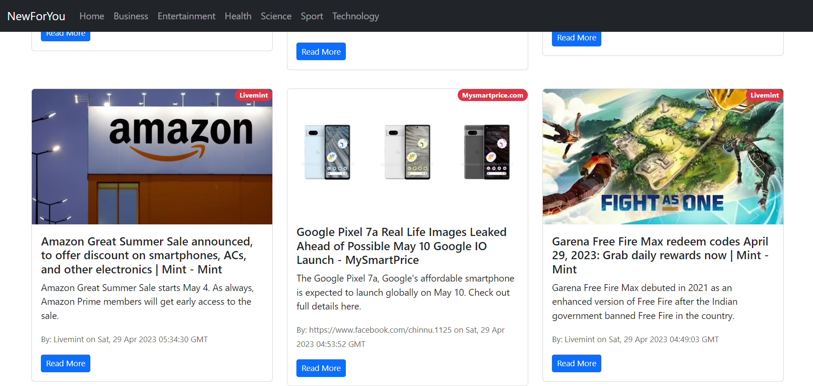
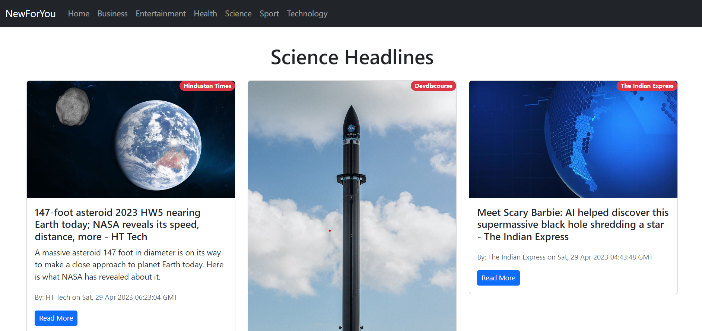

# NewsForYou

The React app utilizes class-based components to fetch and display news articles using the NewsAPI. Users can view news by filtering them by various categories. 

The app only works on development server(localhost) as the API doesn't support deployment.

## Screenshots






## Deployment

Install the dependencies by opening the terminal with path as that of cloned github folder and run:

```bash
  npm install
```

To deploy this project create a .env.local file in the main folder.

Inside the file write:

```bash
  REACT_APP_NEW_API='your_API_key'
```

Run the project on localhost by:

```bash
  npm run start
```
